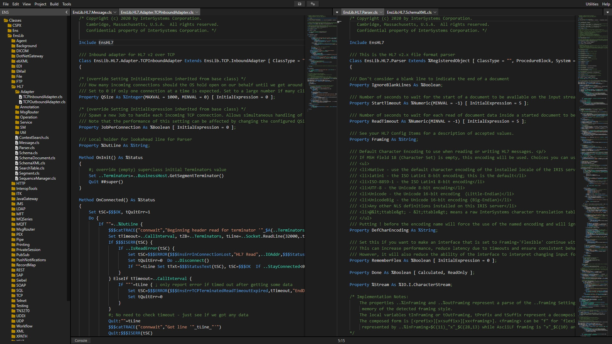

# Cloud Studio

## Introduction

Welcome to an early Preview release of Cloud Studio, a pure web-based code editor for M routines and globals. It is based on the same editor and rendering and web engine as VS Code Server but with no dependencies and self-contained. Documentation will follow an Alpha release. The project is currently "work in progress" and is at the early stages of development and testing. Plan is for integration with all ISO/ANSI compliant M implementations.  Open source and free to use and modify with no restriction. Author:  Sean Connelly 

[Video Demonstration](https://www.youtube.com/watch?v=Am6QAvrPPPg)

## Gitpod
   
 
navigate to:  
https://52773-gitpod_server_address/cloudstudio/CloudStudio.Index.cls
  
&nbsp;&nbsp;&nbsp;&nbsp;  where  
&nbsp;&nbsp;&nbsp;&nbsp;  gitpod_server_address = ramsailopal-intersystem-xxxxxxxxxxx.ws-us81.gitpod.io  

and change the password on request from:  
&nbsp;&nbsp;  Username: **_SYSTEM**  
&nbsp;&nbsp;  Password: **SYS**  

# Local
open in terminal:  
docker run --name my-iris -p 52773:52773 -d ramb0/cloudstudio --check-caps false

navigate to:  
http://localhost:52773/cloudstudio/CloudStudio.Index.cls

and change the password on request from:  
&nbsp;&nbsp;  Username: **_SYSTEM**  
&nbsp;&nbsp;  Password: **SYS**  

# References  
https://github.com/SeanConnelly/CloudStudio  
https://hub.docker.com/r/ramb0/cloudstudio  
https://github.com/coder/code-server

